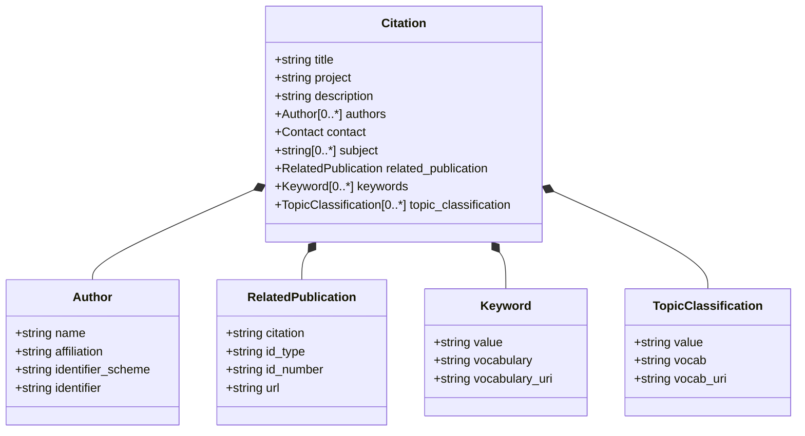

```mermaid
classDiagram
    Citation *-- Author
    Citation *-- RelatedPublication
    Citation *-- Keyword
    Citation *-- TopicClassification
    
    class Citation {
        +string title
        +string project
        +string description
        +Author[0..*] authors
        +Contact contact
        +string[0..*] subject
        +RelatedPublication related_publication
        +Keyword[0..*] keywords
        +TopicClassification[0..*] topic_classification
    }
    
    class Author {
        +string name
        +string affiliation
        +string identifier_scheme
        +string identifier
    }
    
    class RelatedPublication {
        +string citation
        +string id_type
        +string id_number
        +string url
    }
    
    class Keyword {
        +string value
        +string vocabulary
        +string vocabulary_uri
    }
    
    class TopicClassification {
        +string value
        +string vocab
        +string vocab_uri
    }
    
```